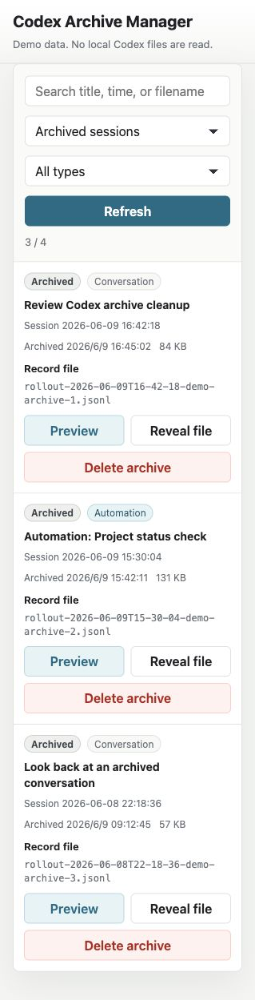

# Codex Archive Manager

Local-first archive viewer and cleaner for Codex Desktop sessions.

> Unofficial and experimental. This project is not affiliated with OpenAI or the Codex team. It reads local Codex Desktop files whose structure may change in future Codex releases.



## What It Does

- Lists archived, current, and local sessions that are no longer shown in the Codex sidebar.
- Searches and filters normal conversations and automation runs.
- Previews archived user/assistant conversations with `Preview`.
- Opens the recorded project folder when it still exists locally.
- Reveals the underlying record file in the system file manager.
- Restores archived sessions back to the Codex sidebar.
- Removes archived session files and the matching local Codex thread index record.

## Run

```sh
npm start
```

Then open:

```txt
http://127.0.0.1:8787
```

Sidebar-friendly mode:

```txt
http://127.0.0.1:8787/?mode=sidebar
```

Demo mode with sample data:

```txt
http://127.0.0.1:8787/?demo=1
```

## What It Reads

- `~/.codex/archived_sessions`
- `~/.codex/sessions`
- `~/.codex/state_5.sqlite`
- `~/.codex/session_index.jsonl`

All data stays local. The app does not upload archives, database contents, project paths, or conversations.

## Delete Behavior

Use `Delete archive` to remove an archived `.jsonl` session file and delete the matching local Codex thread index row.

Use `Delete local record` to remove a `Not in sidebar` session file from `~/.codex/sessions` and delete the matching local Codex database row.

Use `Remove record` on `Missing file` rows to remove a broken database/sidebar reference without deleting any conversation file.

This only changes Codex archive/session metadata. It does not modify files inside your project directories.

Current sessions can be previewed, but they cannot be deleted from this tool.

Rows marked `Not in sidebar` are local Codex session records that still exist on disk, but are not present in Codex's sidebar index. They can be previewed, revealed, or deleted as local records.

Rows marked `Missing file` are database records whose `.jsonl` file is no longer present. They can be removed as broken references, but cannot be restored by this tool.

## Restore Behavior

Use `Restore` to move an archived session back to the Codex sidebar. The app copies the `.jsonl` file from `~/.codex/archived_sessions` back into `~/.codex/sessions/YYYY/MM/DD/`, marks the thread as not archived in `state_5.sqlite`, and appends a sidebar entry to `session_index.jsonl`.

Before restoring, the app creates a local backup under `~/.codex/archive-manager-backups/`.

## Review Archives

Use `Preview` to inspect the archived user/assistant conversation, see the recorded project folder, and open that folder when it still exists locally.

Use `Reveal file` to locate the underlying `.jsonl` record in your system file manager.

## Known Limits

- Codex Desktop local storage is not a public stable API, so future Codex releases may change these paths or schemas.
- The tool does not edit lower-level Codex logs such as `logs_2.sqlite`.
- Current sessions can be inspected, but only archived, `Not in sidebar`, and `Missing file` records can be removed.
- Restore relies on Codex's current local sidebar index format and may need updates if Codex changes it.
- File reveal uses the host OS file manager and is best tested on macOS.

## Safety Notes

- This tool edits local Codex metadata only when you choose `Delete archive`.
- Codex may also keep lower-level logs such as `logs_2.sqlite`; this tool intentionally does not edit those logs.
- Back up your Codex data before using destructive actions on important sessions.
- Do not commit your real `~/.codex` data, `.jsonl` archives, or SQLite databases.

## Requirements

- Node.js
- macOS or Linux shell environment
- `sqlite3` CLI available on `PATH`

## Configuration

```sh
CODEX_HOME=/path/to/.codex PORT=8787 npm start
```

## Status

`v0.1.0` is experimental. It is intended for local use with the current Codex Desktop storage layout.
