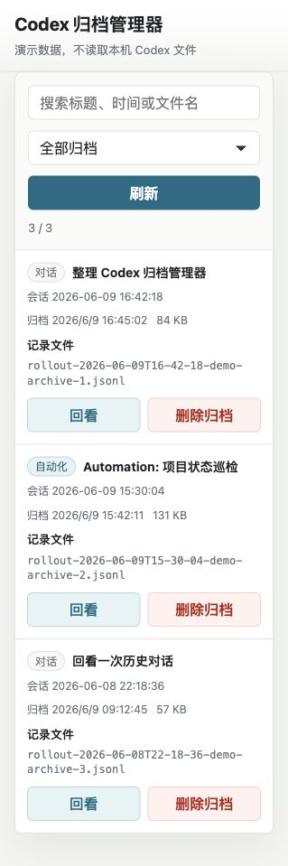

# Codex Archive Manager

Local-first archive viewer and cleaner for Codex Desktop sessions.

> Unofficial and experimental. This project is not affiliated with OpenAI or the Codex team. It reads local Codex Desktop files whose structure may change in future Codex releases.



## What It Does

- Lists archived Codex sessions with readable titles and timestamps.
- Searches and filters normal conversations and automation runs.
- Previews archived user/assistant conversations with `回看`.
- Opens the recorded project folder when it still exists locally.
- Removes archived session files and the matching local Codex thread index record.

## Run

```sh
npm start
```

Then open:

```txt
http://127.0.0.1:8787
```

Sidebar-friendly mode:

```txt
http://127.0.0.1:8787/?mode=sidebar
```

Demo mode with sample data:

```txt
http://127.0.0.1:8787/?demo=1
```

## What It Reads

- `~/.codex/archived_sessions`
- `~/.codex/state_5.sqlite`
- `~/.codex/session_index.jsonl`

All data stays local. The app does not upload archives, database contents, project paths, or conversations.

## Delete Behavior

Use `删除归档` to remove the archived `.jsonl` session file and delete the matching local Codex thread index row.

This only changes Codex archive/session metadata. It does not modify files inside your project directories.

## Review Archives

Use `回看` to preview the archived user/assistant conversation, see the recorded project folder, and open that folder when it still exists locally.

## Safety Notes

- This tool edits local Codex metadata only when you choose `删除归档`.
- Codex may also keep lower-level logs such as `logs_2.sqlite`; this tool intentionally does not edit those logs.
- Back up your Codex data before using destructive actions on important sessions.
- Do not commit your real `~/.codex` data, `.jsonl` archives, or SQLite databases.

## Requirements

- Node.js
- macOS or Linux shell environment
- `sqlite3` CLI available on `PATH`

## Configuration

```sh
CODEX_HOME=/path/to/.codex PORT=8787 npm start
```

## Status

`v0.1.0` is experimental. It is intended for local use with the current Codex Desktop storage layout.
